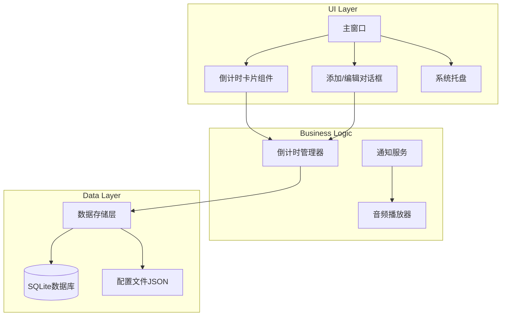
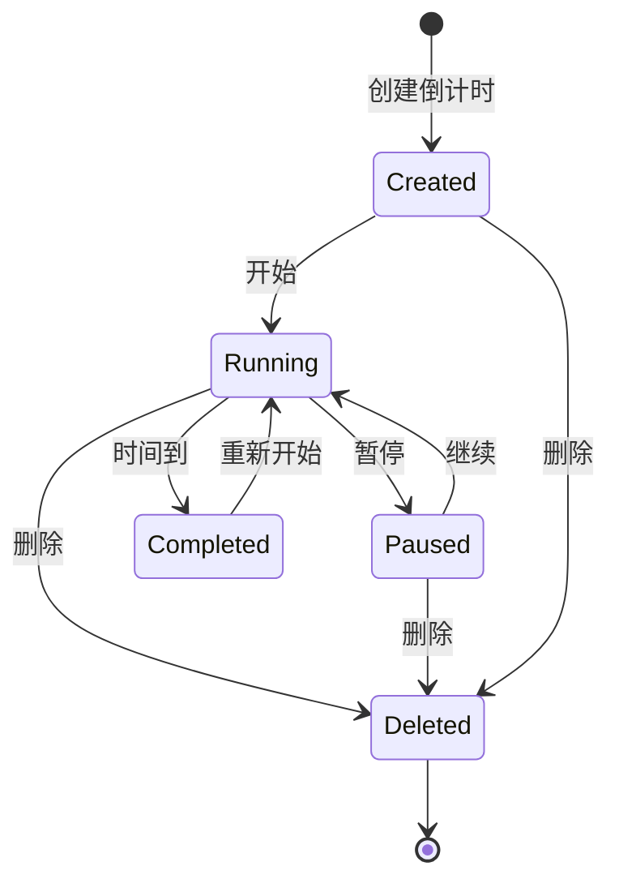
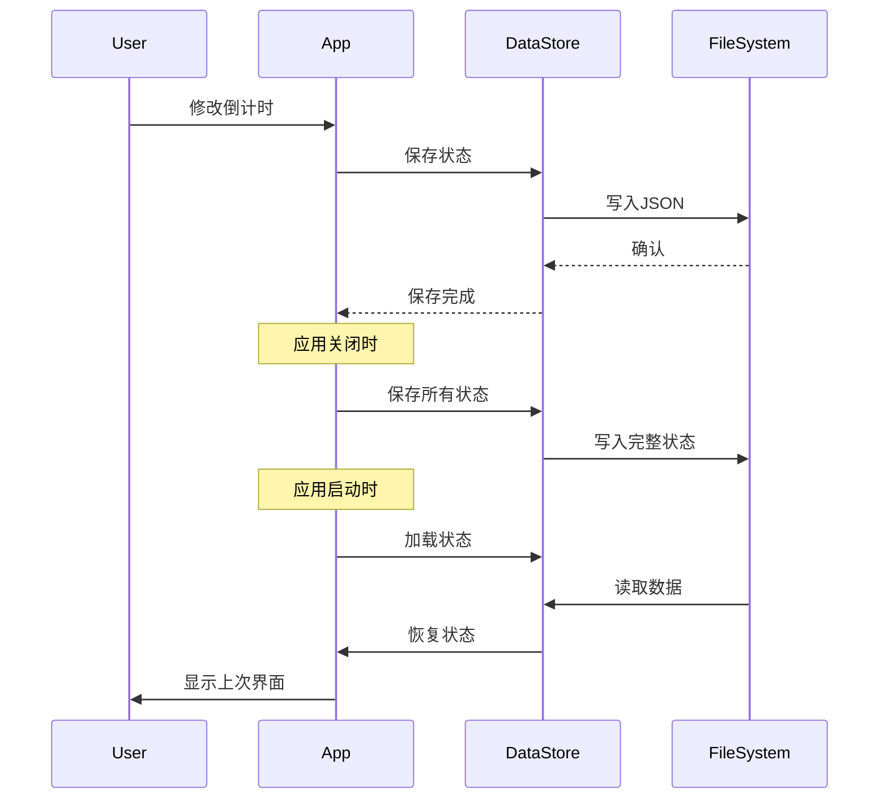

# Windows 多倒计时桌面软件 - 技术方案

## 项目概述

开发一个 Windows 桌面倒计时应用，用于管理一天中不同时间段的工作和休息。支持多个独立倒计时，每个倒计时有独特的颜色标识，具备状态记忆功能。

## 技术选型

### 推荐方案：PyQt6 + SQLite

| 组件 | 技术选择 | 理由 |
|------|----------|------|
| GUI框架 | PyQt6 | 现代、跨平台、支持圆角样式、社区成熟 |
| 数据存储 | SQLite + JSON | 轻量级本地存储，无需额外服务 |
| 打包工具 | PyInstaller | 生成独立 .exe 文件，无需安装 Python |
| 通知系统 | win10toast / plyer | Windows 原生系统通知 |
| 音频播放 | pygame / QSound | 内置音频播放能力 |

### 备选方案对比

| 方案 | 优点 | 缺点 |
|------|------|------|
| PyQt6 | 功能强大、样式灵活、文档丰富 | 打包体积较大 |
| Tkinter | Python内置、轻量 | 现代UI实现困难 |
| CustomTkinter | 现代美观、基于Tkinter | 社区较小 |
| PySide6 | Qt官方支持 | 与PyQt6类似 |

## 系统架构



## 数据模型设计

### 倒计时实体 (Timer)

```python
@dataclass
class Timer:
    id: str                    # 唯一标识符
    name: str                  # 倒计时名称
    duration_seconds: int      # 设定时长（秒）
    remaining_seconds: int     # 剩余时间（秒）
    color: str                 # 显示颜色（十六进制）
    status: str                # 状态：running/paused/stopped
    created_at: datetime       # 创建时间
    position: int              # 显示顺序
```

### 应用状态 (AppState)

```python
@dataclass
class AppState:
    timers: List[Timer]        # 所有倒计时
    window_geometry: dict      # 窗口位置和大小
    volume: float              # 提示音量
    theme: str                 # 主题设置
```

## UI 设计方案

### 整体布局

```
┌─────────────────────────────────────────────────────┐
│  ⏱️ 多倒计时管理器                    [─] [□] [×]   │
├─────────────────────────────────────────────────────┤
│                                                     │
│  ┌─────────────────────────────────────────────┐   │
│  │ 🟢 深度工作        00:25:00      [⏸] [✏️] [🗑️] │   │
│  └─────────────────────────────────────────────┘   │
│                                                     │
│  ┌─────────────────────────────────────────────┐   │
│  │ 🔵 休息时间        00:05:00      [⏸] [✏️] [🗑️] │   │
│  └─────────────────────────────────────────────┘   │
│                                                     │
│  ┌─────────────────────────────────────────────┐   │
│  │ 🟣 阅读时间        00:30:00      [▶] [✏️] [🗑️] │   │
│  └─────────────────────────────────────────────┘   │
│                                                     │
├─────────────────────────────────────────────────────┤
│                              [+ 添加倒计时]         │
└─────────────────────────────────────────────────────┘
```

### 配色方案（清爽理性风格）

| 用途 | 颜色代码 | 说明 |
|------|----------|------|
| 背景色 | `#F8F9FA` | 浅灰白 |
| 卡片背景 | `#FFFFFF` | 纯白 |
| 主色调 | `#4A90D9` | 冷静蓝 |
| 文字色 | `#2C3E50` | 深灰 |
| 边框色 | `#E1E4E8` | 淡灰 |

### 预设倒计时颜色

```python
TIMER_COLORS = [
    '#4CAF50',  # 绿色 - 工作
    '#2196F3',  # 蓝色 - 学习
    '#9C27B0',  # 紫色 - 阅读
    '#FF9800',  # 橙色 - 休息
    '#00BCD4',  # 青色 - 运动
    '#E91E63',  # 粉色 - 其他
    '#795548',  # 棕色 - 思考
    '#607D8B',  # 灰蓝 - 会议
]
```

## 核心功能流程

### 倒计时生命周期



### 状态保存流程



## 项目目录结构

```
countdown-timer/
├── src/
│   ├── main.py              # 应用入口
│   ├── app.py               # 应用主类
│   ├── models/
│   │   ├── __init__.py
│   │   └── timer.py         # 数据模型
│   ├── widgets/
│   │   ├── __init__.py
│   │   ├── main_window.py   # 主窗口
│   │   ├── timer_card.py    # 倒计时卡片
│   │   └── add_dialog.py    # 添加对话框
│   ├── services/
│   │   ├── __init__.py
│   │   ├── timer_manager.py # 倒计时管理
│   │   ├── notification.py  # 通知服务
│   │   └── sound_player.py  # 音频播放
│   ├── data/
│   │   ├── __init__.py
│   │   └── store.py         # 数据存储
│   └── utils/
│       ├── __init__.py
│       └── config.py        # 配置管理
├── assets/
│   ├── sounds/
│   │   └── notification.wav # 提示音
│   └── icons/
│       └── app_icon.ico     # 应用图标
├── tests/
│   └── test_timer.py
├── requirements.txt
├── build.spec               # PyInstaller配置
└── README.md
```

## 依赖清单

```txt
PyQt6>=6.5.0
pygame>=2.5.0
plyer>=2.1.0
pyinstaller>=6.0.0
```

## 实现步骤

### 第一阶段：基础框架
1. 创建项目结构和基础文件
2. 实现数据模型
3. 搭建主窗口框架

### 第二阶段：核心功能
4. 实现倒计时卡片组件
5. 实现倒计时管理器（计时逻辑）
6. 实现添加/编辑对话框

### 第三阶段：持久化
7. 实现数据存储层
8. 实现状态保存和恢复

### 第四阶段：通知系统
9. 实现系统通知
10. 实现声音提醒

### 第五阶段：打包发布
11. 配置 PyInstaller
12. 打包测试
13. 优化和完善

## 注意事项

1. **时间精度**：使用 QTimer，精度约 1 秒，满足倒计时需求
2. **状态恢复**：保存剩余时间和状态，重启后继续计时
3. **打包体积**：PyQt6 打包后约 50-80MB，属于正常范围
4. **系统托盘**：支持最小化到托盘，后台运行
